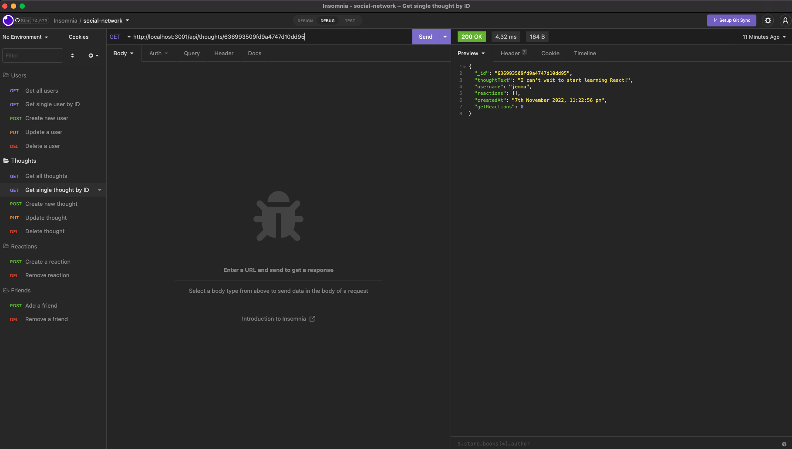

# social-network-nosql

This project is an API for a social network web application where users can share their thoughts, react to friends’ thoughts, and create a friend list. I have used Express.js for routing, a MongoDB database, and the Mongoose ODM.

[See below](#link-to-walkthrough-video) for a walkthrough video link.

## User Story

```md
AS A social media startup
I WANT an API for my social network that uses a NoSQL database
SO THAT my website can handle large amounts of unstructured data
```

## Acceptance Criteria

```md
GIVEN a social network API
WHEN I enter the command to invoke the application
THEN my server is started and the Mongoose models are synced to the MongoDB database
WHEN I open API GET routes in Insomnia for users and thoughts
THEN the data for each of these routes is displayed in a formatted JSON
WHEN I test API POST, PUT, and DELETE routes in Insomnia
THEN I am able to successfully create, update, and delete users and thoughts in my database
WHEN I test API POST and DELETE routes in Insomnia
THEN I am able to successfully create and delete reactions to thoughts and add and remove friends to a user’s friend list
```

## Required Packages:

* [mongoose](https://www.npmjs.com/package/mongoose) for MongoDB and object modeling.
* [express](https://www.npmjs.com/package/express) for back-end and routing.
* [moment](https://www.npmjs.com/package/connect-session-sequelize) to format timestamps.
* [nodemon](https://www.npmjs.com/package/nodemon) to automatically restart applications when file changes are detected. 

# Screenshots of Application Interaction:

* GET all users:


* POST a new user:


* PUT to update a user by its _id:


* GET a single thought by its _id:



* PUT to update a thought by its _id:


* DELETE to remove a thought by its _id:


* POST to add a new friend to a user's friend list:


* POST to create a reaction stored in a single thought's reactions array field:


# Link to Walkthrough Video:

[Click here](https://www.youtube.com/watch?v=9dYM0YugvxA&ab_channel=PriscillaLuong)

### Final note:

_Any feedback to improve code or implement best practice would be appreciated_ 😊
